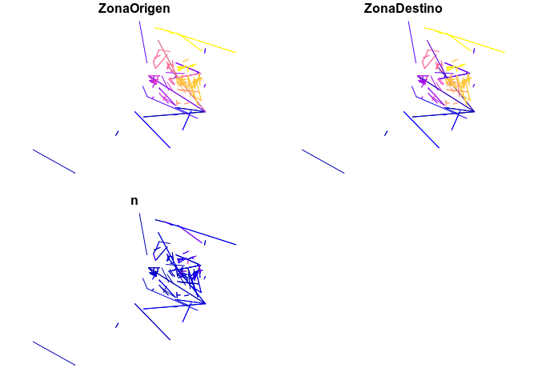
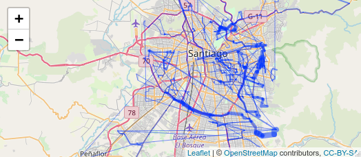

<!-- README.md is generated from README.Rmd. Please edit that file -->

# pctSantiago

## Introduction

The goal of pctSantiago is to create a proof-of-concept or prototype of
a ‘Pedalea’ web application to help prioritise active transport policies
and investment where they are most urgently needed. The starting point
is the Propensity to Cycle Tool web app and research project hosted at
<http://www.pct.bike/>

In terms of project workflow, the simplest approach is to push
everything into this README.Rmd file, with specific scripts going
directly into the repo’s route directory (this is not an R package, yet,
so no need for an R folder) and data going in the releases.

In terms of software, we will use the following packages:

``` r
# install.packages("remotes")
pkgs_cran = c(
  "leaflet",
  "readr", # read data
  "dplyr", # data analysis
  "tmap",
  "sf" # spatial package
)
remotes::install_cran(pkgs_cran)
#> Skipping install of 'leaflet' from a cran remote, the SHA1 (2.0.2) has not changed since last install.
#>   Use `force = TRUE` to force installation
#> Skipping install of 'readr' from a cran remote, the SHA1 (1.3.1) has not changed since last install.
#>   Use `force = TRUE` to force installation
#> Skipping install of 'dplyr' from a cran remote, the SHA1 (0.8.0.1) has not changed since last install.
#>   Use `force = TRUE` to force installation
#> Skipping install of 'tmap' from a cran remote, the SHA1 (2.2) has not changed since last install.
#>   Use `force = TRUE` to force installation
#> Skipping install of 'sf' from a cran remote, the SHA1 (0.7-3) has not changed since last install.
#>   Use `force = TRUE` to force installation
pkgs_github = c(
  "ropensci/stplanr",
  "ITSLeeds/pct",
  "GIScience/openrouteservice-r"
)
remotes::install_github(pkgs_github)
#> Skipping install of 'stplanr' from a github remote, the SHA1 (41d378d5) has not changed since last install.
#>   Use `force = TRUE` to force installation
#> Skipping install of 'pct' from a github remote, the SHA1 (6d70d0b1) has not changed since last install.
#>   Use `force = TRUE` to force installation
#> Skipping install of 'openrouteservice' from a github remote, the SHA1 (87a03ddd) has not changed since last install.
#>   Use `force = TRUE` to force installation
```

We’ll use `dplyr`:

``` r
suppressPackageStartupMessages(library(dplyr))
```

## Input data

Data provided by Ignacio Tiznado Aitken was imported and cleaned as
follows (code not run):

``` r
d = readr::read_delim("~/hd/data/raw/od/EOD2012_Stgo.csv", delim = ";")
names(d) 
names_include = grep("Zon|Coord|Mod", names(d))
d = d[names_include] %>% 
    filter(ZonaOrigen < 999, ZonaOrigen > 0, ZonaDestino < 999, ZonaDestino > 0) %>%
  filter(ZonaOrigen != ZonaDestino)
summary(d$OrigenCoordX)
summary(d$ZonaOrigen) # 800+ zones
unique(d$ModoAgregado) # what are the mode codes?
d_agg_zone = d %>% 
  group_by(ZonaOrigen, ZonaDestino) %>% 
  summarise(n = n())
summary(factor(d_agg_zone$ZonaOrigen))
d_agg_sub = d_agg_zone %>% 
  filter(n > 15)

# geo data
download.file("http://www.sectra.gob.cl/descargas/encuestas_movilidad/santiago/Zonificacion_EOD2012.zip", "Zonificacion_EOD2012.zip")
unzip("Zonificacion_EOD2012.zip")
z = sf::read_sf("Zonificacion_EOD2012.shp")
summary(z)
z = sf::st_sf(data.frame(geo_code = 1:max(d$ZonaOrigen)), geometry = z$geometry)

od_agg_zone_sub = stplanr::od2line(flow = d_agg_sub, z)
mapview::mapview(od_agg_zone_sub)
saveRDS(od_agg_zone_sub, "od_agg_zone_sub.Rds")
piggyback::pb_upload("od_agg_zone_sub.Rds")
piggyback::pb_download_url("od_agg_zone_sub.Rds")
```

## Desire line analysis

We can explore the OD data as
follows:

``` r
u = "https://github.com/pedalea/pctSantiago/releases/download/0.0.1/od_agg_zone_sub.Rds"
download.file(u, destfile = "od_agg_zone_sub.Rds")
desire_lines = readRDS("od_agg_zone_sub.Rds") %>%
  sf::st_transform(4326)
plot(desire_lines)
```

<!-- -->

``` r
library(leaflet)
# leaflet() %>% 
#   addTiles() %>% 
#   addPolylines(data = desire_lines )
```

## Route generation and analysis

``` r
# source: https://giscience.github.io/openrouteservice-r/articles/openrouteservice.html
# generate a single route:
coords = sf::st_coordinates(desire_lines[1, ])[, 1:2]
r1 = openrouteservice::ors_directions(
  coordinates = list(coords[1, ], coords[2, ])
  , format = "geojson"
  , parse_output = FALSE
  )
# r1j = jsonlite::toJSON(r1)
r1_sf = geojsonsf::geojson_sf(r1)
leaflet() %>% 
  addTiles() %>% 
  addPolylines(data = r1_sf)

route_ors = function(from, to) {
  r1 = openrouteservice::ors_directions(
  coordinates = list(from, to)
  , format = "geojson"
  , parse_output = FALSE
  )
  geojsonsf::geojson_sf(r1)
}
coord_list = lapply(1:nrow(desire_lines), function(i) {
  coords = sf::st_coordinates(desire_lines[i, ])[, 1:2]
  list(coords[1, ], coords[2, ])
})

route_ors(coord_list[[1]][[1]], coord_list[[1]][[2]])
# note: this is wasteful.
rs = parallel::mclapply(mc.cores = parallel::detectCores(), 
                        1:nrow(desire_lines), function(i) {
  route_ors(coord_list[[i]][[1]], coord_list[[i]][[2]])
})
saveRDS(rs, "rs.Rds")
rs[[1]]
sapply(rs, ncol)
sapply(rs, names)
rs_min = lapply(rs, function(x) sf::st_linestring(sf::st_coordinates(x)))
rs_min[[1]]
rs_geom = sf::st_sf(geometry = sf::st_sfc(rs_min))
nverts = stplanr::n_vertices(rs_geom)
summary(nverts)
rs_geom = rs_geom[nverts > 100, ]
rs_geom$n = 1
saveRDS(rs_geom, "rs_geom.Rds")
piggyback::pb_upload("rs_geom.Rds")
```

## Cycling uptake

## Route networks and recommendations

This section aims to show how recommendations can be generated.

``` r
rs_geom = readRDS("rs_geom.Rds")
rnet = stplanr::overline2(rs_geom, attrib = "n")
#> Warning in fun(libname, pkgname): rgeos: versions of GEOS runtime 3.7.0-CAPI-1.11.0
#> and GEOS at installation 3.6.2-CAPI-1.10.2differ
#> Loading required namespace: pbapply
#> 2019-03-20 01:56:00 constructing segments
#> 2019-03-20 01:56:00 transposing 'B to A' to 'A to B'
#> 2019-03-20 01:56:00 removing duplicates
#> 2019-03-20 01:56:01 restructuring attributes
#> 2019-03-20 01:56:01 building geometry
#> 2019-03-20 01:56:01 simplifying geometry
#> large data detected, using regionalisation
#> 2019-03-20 01:56:01 regionalisation complete
#> 2019-03-20 01:56:02 rejoining segments into linestrings
# leaflet() %>%
#   addTiles() %>%
#   addPolylines(data = rnet, weight = rnet$n)

```

<!-- -->
